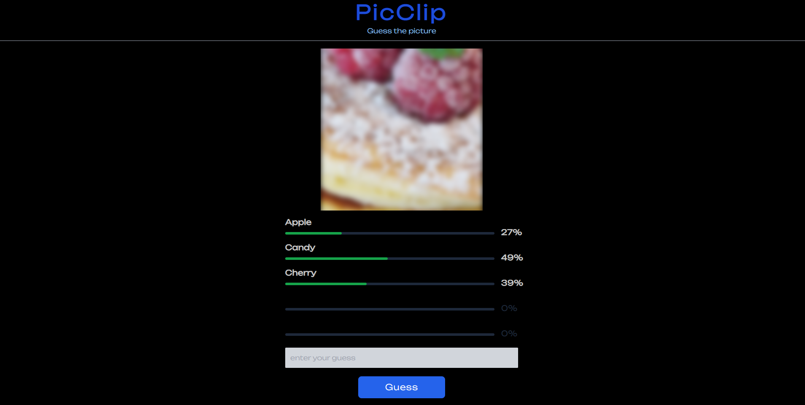

# Mini-Project: Picclip

## Goal
To Build a game that uses <a href="https://github.com/UKPLab/sentence-transformers" target="__blank">sentence-transformers</a> and python as a backend.

### Run the project

1. Open a terminal in VS Code
2. Type `cd frontend`
3. Type `yarn install`
4. Use `yarn dev:frontend` to start the frontend dev environment.

### Try out the game 
https://picclip.netlify.app/

### Issues
Sometimes the image isn't the most accurate

### Future goals
I'm planing on intergrating DALL-E to generate the image. Currently i'm using https://pixabay.com/api to get a image that matches the word of the day. 
